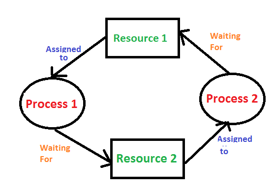

# What is an OS?

An OS is a collection of system softwares that acts as an interface between the computer hardware and the user and manages various resources and provides common services[^1] to the computer programs.

# What are the functions of an OS?

The main functions of an operating system include:

1. **Resource management**: The OS manages and allocates system resources, such as memory, processors, and input/output devices, to ensure that programs and users have access to the resources they need to function.
2. **Memory management**: The OS manages the allocation and deallocation of memory to programs and processes, as well as handling virtual memory, which allows a computer to compensate for shortages of physical memory by temporarily transferring data from RAM to disk storage.
3. **Process management**: The OS coordinates the execution of programs and processes, scheduling tasks and allocating resources to ensure that each process has access to the resources it needs. The OS also handles process synchronization and communication, allowing processes to interact with each other and share data.
4. **File management**: The OS manages the organization, storage, and retrieval of files on a computer's storage devices. This includes creating, deleting, and manipulating files and directories, as well as managing permissions and access to files.
5. **Networking**: The OS manages network communication and connectivity, allowing programs and devices to communicate over a network and access resources on other computers.
6. **Security**: The OS provides security measures to protect against unauthorized access to system resources and data. This can include user authentication, firewall protection, and encryption.
7. **User interface**: The OS provides a user interface, such as a graphical user interface (GUI), that allows users to interact with the system and access its resources and programs.

# What are different kinds of OS?

Types of operating system:

-   Batch OS
-   Distributed OS
-   Multitasking OS
-   Network OS
-   Real-Time OS
-   Mobile OS

# What is kernel and its types?

The kernel is the central part of an operating system (OS) that controls all the other parts of the system and manages the hardware resources of the computer. It is the foundation of the OS and provides the basic functions that are needed to run the system and other programs.

There are several types of kernels that can be used in an operating system:

1. **Monolithic kernel**: A monolithic kernel is a single, large block of code that contains all the core functions of the operating system. It runs in kernel mode and has direct access to the hardware resources of the computer. Examples of operating systems with monolithic kernels include Linux and BSD.
2. **Microkernel**: A microkernel is a small kernel that contains only the basic functions needed to manage the hardware resources of the computer. Other parts of the operating system, such as device drivers and file systems, run as separate programs in user mode and communicate with the kernel through interprocess communication (IPC) mechanisms. Examples of operating systems with microkernels include QNX and MINIX.
3. **Hybrid kernel**: A hybrid kernel is a combination of a monolithic kernel and a microkernel. It includes some core functions of the operating system in the kernel, but also allows other parts of the system to run as separate programs in user mode. Examples of operating systems with hybrid kernels include Windows NT and macOS.

The choice of kernel design depends on the specific requirements and goals of the operating system, as well as the hardware resources and constraints of the system it will be running on. Some operating systems may use a custom kernel that is tailored to their specific needs and design constraints, while others may use a standard kernel with additional modifications or extensions.

# What are the different types of interfaces to interact with a computer system?

There are several types of interfaces that can be used to interact with an operating system (OS) and a computer:

1. **Graphical user interface (GUI)**: A GUI is a type of interface that uses visual elements such as windows, icons, and menus to allow users to interact with the system and perform tasks. Examples of operating systems with GUIs include Windows, macOS, and Linux.
2. **Command-line interface (CLI)**: A CLI is a type of interface that allows users to enter commands and execute them by typing them into a command prompt or terminal window. Examples of operating systems with CLIs include Unix-like systems such as Linux and macOS, as well as Microsoft Windows.
3. **Procedure-language interface (PLI)**: A Procedure Language Interface (PLI) is a programming interface that allows a programmer to write code in a high-level language, such as C or FORTRAN, that can be called by a program written in a different language, such as assembly language or a hardware description language. Examples of PLIs include the Python interactive interpreter, the SQL command-line interface, and other interfaces that allow users to write and execute procedures or scripts written in a programming language.
4. **System Call Interface (SCI)**: SCI (System Call Interface) is a set of functions and mechanisms provided by an operating system (OS) that allows programs to request services from the OS. These functions are typically implemented as part of the OS kernel, and are designed to provide a standard way for programs to access resources and perform tasks that are normally reserved for the OS. Examples of services that might be provided through SCI include accessing files, allocating memory, creating processes, and communicating with other programs.
5. **Application programming interface (API)**: An API is a set of protocols and tools that allows different software systems to communicate with each other and exchange data. Examples of APIs include the Facebook API, which allows developers to access and use the functionality of the Facebook platform, and the Google Maps API, which allows developers to include maps and location-based functionality in their applications.
6. **Web interface**: A web interface is a type of interface that allows users to interact with a system or application through a web browser. Examples of web interfaces include online banking sites, email services, and social media platforms.
7. **Mobile interface**: A mobile interface is a type of interface that is designed for use on a mobile device, such as a smartphone or tablet. Mobile interfaces often use touch gestures and other input methods that are optimized for use on a small screen.
8. **Voice interface**: A voice interface is a type of interface that allows users to interact with a system or application using voice commands. Voice interfaces are often used with virtual assistants, such as Amazon's

# Differentiate between SCI, API, CLI and PLI

One key difference between SCI and PLI is the level at which they operate. SCI is a set of functions provided by the OS that allow programs to request services from the OS, while PLI is a programming interface that allows programmers to write code in a high-level language that can be called by programs written in other languages.

# Do PLI have their own interpreter and compilers?

Whether a PLI includes its own interpreter and/or compiler depends on the specific implementation of the PLI and the programming language being used. Some PLIs may include an interpreter and/or compiler, while others may rely on external interpreter and compiler programs.

Here are examples of PLIs (procedure-language interfaces) that include their own interpreters and/or compilers:

- **Python interactive interpreter**: The Python interactive interpreter is a PLI that includes an interpreter that allows users to write and execute Python code in an interactive manner, without the need to create and run a separate Python script.
- **Java Development Kit (JDK)**: The JDK is a PLI that includes both an interpreter and a compiler for the Java programming language. Users can write and execute Java code using the interpreter, or compile the code into machine code that can be run as a standalone program using the compiler.

# Differentiate between process and threads

In summary, a process is an instance of a program that is being executed by a computer, while a thread is a separate execution path within a process. Processes are generally isolated from one another and have their own memory space and resources, while threads can execute concurrently within a single process and may be able to share resources and data.

# What are the various types of processes?

There are several types of processes that can exist within an operating system (OS):

1. **System processes**: These are processes that are created and managed by the OS itself, and are responsible for performing essential tasks such as managing system resources, handling system events, and providing common services to other processes. Examples: the kernel, system daemons, and system libraries.
2. **User processes**: These are processes that are created and managed by users, and are responsible for performing tasks such as running applications, accessing system resources, and communicating with other processes. Examples: web browsers, word processors, and games.
3. **Background processes**: These are processes that run in the background and perform tasks such as updating software, managing system resources, and performing maintenance tasks. Examples: update managers, system monitors, and backup utilities.
4. **Foreground processes**: These are processes that run in the foreground and are visible to the user, such as applications and programs that are being actively used by the user. Examples: text editors, media players, and games.
5. **Daemon processes**: These are processes that run in the background and are usually associated with system services, such as network servers, print spoolers, and system event handlers. Examples: web servers, database servers, and file servers.
6. **Interrupt processes**: These are processes that are initiated by hardware or software interrupts, and are responsible for handling events such as system failures, hardware errors, and external input/output requests. Examples: interrupt handlers, device drivers, and system utilities.

# What are the different kinds of process based on their relationship with other process?

Processes can be categorized based on their relationship with other processes, as follows:

-   **Parent processes**: Processes that create and manage child processes.
-   **Child processes**: Processes that are created by another process (the parent process).
-   **Orphan processes**: Processes that are no longer associated with a parent process.
-   **Zombie processes**: Processes that have completed execution but have not yet been cleaned up by the operating system.

# What do you mean by virtual memory?

Virtual memory is a feature that allows a computer to use a hard disk or other storage device as additional memory when physical memory (RAM) becomes full. This allows the computer to run larger programs and handle more complex tasks, and enables multiple programs to run concurrently. However, accessing data on the hard disk is generally slower than accessing data in RAM, so using virtual memory can also slow down a computer. It is therefore important to have enough physical memory to meet the needs of the programs and tasks being run on a computer in order to minimize the use of virtual memory and maintain good performance.

# What are the advantages and disadvantages of virtual memory?

Advantages of virtual memory:

1. Allows a computer to run larger programs or multiple programs concurrently
2. Increases the amount of memory available to a program
3. Provides a way for a computer to access data stored on external devices, such as a hard drive or network drive, even if the data does not fit in physical memory.

Disadvantages of virtual memory:

1. Can slow down system performance because accessing data in virtual memory is slower than accessing data in RAM
2. Can cause the computer to run out of space on the hard disk if the virtual memory usage becomes too large
3. Can cause the computer to crash if the hard disk becomes full and there is no space left for virtual memory

# What is thrashing in OS?

Thrashing is a term used to describe a situation in which a computer's CPU (central processing unit) is constantly switching between different processes, but is unable to make meaningful progress on any of them. This can occur when a computer's memory is overburdened and unable to keep up with the demands of the processes being executed by the CPU.

When thrashing occurs, the computer's performance can be severely degraded, as the CPU is unable to perform any useful work. This can result in slow response times, difficulty running applications, and overall poor system performance.

# Why does thrashing occur?

Thrashing can occur for a variety of reasons, including:

1. **Insufficient memory**: When the system does not have enough memory to accommodate the demands of the processes being executed, it may be forced to constantly swap data in and out of memory, which can lead to thrashing.
2. **Too many processes running concurrently**: If the system is running too many processes concurrently, it may be unable to allocate sufficient resources (e.g., CPU time, memory) to each process, leading to thrashing.
3. **Lack of CPU resources**: If the system's CPU is not powerful enough to keep up with the demands of the processes being executed, it may be unable to make meaningful progress on any of them, leading to thrashing.
4. **Poorly designed algorithms**: If the algorithms being used by the processes are poorly designed, they may require more resources than necessary to execute, leading to thrashing.

# How to avoid thrashing?

Ways to avoid thrashing in an operating system:

1. Increase the amount of physical memory.
2. Close unnecessary applications.
3. Reduce the number of concurrently running processes.
4. Optimize algorithms.
5. Upgrade the CPU.
6. Use the long-term scheduler to carefully manage the allocation of resources to processes.

# How long term scheduler can avoid thrashing?

The long-term scheduler in an operating system helps to prevent thrashing by carefully managing the allocation of resources to processes. It prioritizes the allocation of resources to more memory-intensive or CPU-intensive processes, which can help to ensure that the system is running smoothly and efficiently. This can reduce the need for the system to use virtual memory and improve the overall performance of the system.

# What is RAID, and what are its types?

RAID (Redundant Array of Independent Disks) is a technology that combines multiple physical disk drives into a single logical storage unit for the purpose of data redundancy and/or performance improvement.

Some common types of RAID and their characteristics include:

**RAID 0**: Provides striping (data is divided into blocks and written across multiple disks) but no redundancy. This type of RAID offers improved performance but no data protection.

**RAID 1**: Provides data mirroring (data is written to two or more disks simultaneously). This type of RAID offers good data protection but does not improve performance.

**RAID 5**: Provides striping with distributed parity (data is striped across multiple disks and a parity block is written to each disk). This type of RAID offers improved performance and good data protection, but requires a minimum of three disks.

**RAID 6**: Similar to RAID 5, but with an additional parity block (2 parity blocks), providing improved data protection.

**RAID 10**: A combination of RAID 1 and RAID 0, offering both data mirroring and striping. This type of RAID offers good data protection and improved performance, but requires a minimum of four disks.

RAID is often used in enterprise storage systems, but it can also be used in smaller scale storage systems, such as home servers or desktop computers.

[^1]: These services can include things like file management, networking, and security, and allow programs to easily access and use shared resources and functionality provided by the system. This makes it easier for programs to interact with the system and with each other, and allows developers to focus on building the core functionality of their programs rather than having to reinvent the wheel for basic tasks.

# What is deadlock, and what are the necessary conditions for deadlock to occur?

A deadlock is a situation in which two or more processes are blocked and unable to proceed because they are waiting for a resource held by one of the other processes. This can create a cycle in which each process is waiting for a resource held by another process, resulting in a standstill.

There are several necessary conditions that must be present for a deadlock to occur:

1. **Mutual exclusion**: At least one resource must be non-sharable, meaning that it cannot be used by more than one process at a time.
2. **Hold and wait**: A process must be holding a resource while waiting for another resource. 
3. **No preemption**: A process cannot be forced to release a resource it is holding.
4. **Circular wait**: There must be a circular chain of processes, each waiting for a resource held by the next process in the chain.

# What are the various approaches to preventing or avoiding deadlocks, and how do they differ from each other?

Main approaches to preventing or avoiding deadlocks, and how they differ from each other:

**Deadlock prevention**: This approach involves adding additional constraints to the system to prevent the occurrence of deadlocks. One common method is to require processes to request all the resources they will need before they start executing, which can help to prevent the hold and wait condition.

**Deadlock avoidance**: This approach involves dynamically adjusting the allocation of resources to processes in order to avoid the possibility of deadlocks. One common method is the “banker's algorithm” which uses a priority system to determine which processes should be allocated resources and when.

**Deadlock detection**: This approach involves periodically checking for the presence of deadlocks and taking action to resolve them if they are detected. This can involve pre-empting one of the processes involved in the deadlock and rolling back its actions to release the resource it is holding.

In general, deadlock prevention and deadlock avoidance are proactive approaches that aim to prevent deadlocks from occurring in the first place, while deadlock detection is a reactive approach that involves identifying and resolving deadlocks after they have occurred.

# What is fragmentation of memory?

Memory fragmentation is a phenomenon that occurs when the available free memory in a computer's operating system is split into small chunks that are scattered throughout the memory. These small chunks of free memory are too small to be used efficiently and can lead to decreased system performance. There are two main types of memory fragmentation: external fragmentation and internal fragmentation.

# Differentiate between two types of Fragmentation

# What is SPOOLING?

Spooling is a technique used by operating systems to temporarily store data in a buffer or queue while it is being transmitted or processed. The term "spool" is an acronym for "Simultaneous Peripheral Operations On-Line". It is used to increase the efficiency of input/output (I/O) operations by allowing the data to be transmitted or processed in the background while the computer is able to perform other tasks.

There are several types of spooling that can be used in an operating system, including:

- **Printer spooling**: In printer spooling, data to be printed is temporarily stored in a buffer or queue and then transmitted to the printer as it becomes available. This allows the computer to continue working on other tasks while the printer is printing the data.
- **Disk spooling**: In disk spooling, data to be written to a disk is temporarily stored in a buffer or queue and then written to the disk in a batch, rather than writing each piece of data individually. This can increase the efficiency of disk I/O operations by reducing the number of read/write head movements.
- **Network spooling**: In network spooling, data to be transmitted over a network is temporarily stored in a buffer or queue and then transmitted as it becomes available. This allows the computer to continue working on other tasks while the data is being transmitted.  

Spooling is an important technique used in operating systems to improve the efficiency of I/O operations and to allow the computer to perform multiple tasks simultaneously.

# What are semaphores and what are its types?

A **semaphore** is a synchronization object that is used to control access to a shared resource in a parallel programming environment. It is a value that is used to indicate whether a resource is available or in use, and it can be used to allow or block access to the resource. Semaphores can be either binary (0 or 1) or can have a value greater than 1, depending on the implementation.

There are several **types of semaphores**, including:

- **Binary semaphores**: A binary semaphore is a type of semaphore that has a value of either 0 or 1. It is used to indicate whether a resource is available or in use.  
- **Counting semaphores**: A counting semaphore is a type of semaphore that has a value greater than 1. It is used to keep track of the number of available resources or to allow a certain number of threads or processes to access a resource simultaneously.
- **Mutex semaphores**: A mutex semaphore is a type of semaphore that is used to implement mutual exclusion. It is similar to a mutex in that it allows only one thread or process to access a resource at a time, but it is implemented as a semaphore rather than a separate synchronization object.
- **Reader-writer semaphores**: A reader-writer semaphore is a type of semaphore that is used to synchronize access to a shared resource by multiple threads or processes. It allows multiple threads or processes to read the resource simultaneously, but only allows one thread or process to write to the resource at a time.

# What are mutexes and what are its types?

A mutex (short for "mutual exclusion") is a synchronization object that is used to control access to a shared resource in a parallel programming environment. It is used to ensure that only one thread or process can access the resource at a time, in order to prevent conflicts or race conditions.

There are several types of mutexes, including:

- **Spinlock mutexes**: A spinlock mutex is a type of mutex that uses busy waiting (also known as "spinning") to acquire a lock on a resource. When a thread or process tries to acquire a lock on a resource that is already locked, it will repeatedly check the lock status until it becomes available, rather than going to sleep or blocking.
- **Sleep mutexes**: A sleep mutex is a type of mutex that puts a thread or process to sleep when it tries to acquire a lock on a resource that is already locked. The thread or process will be awoken when the lock becomes available.
- **Recursive mutexes**: A recursive mutex is a type of mutex that allows a thread or process to acquire a lock on a resource multiple times. This is useful when a thread or process needs to acquire a lock on a resource multiple times within a nested set of function calls.
- **Priority-inheritance mutexes**: A priority-inheritance mutex is a type of mutex that increases the priority of a thread or process that holds a lock on a resource. This is used to prevent priority inversion, which can occur when a high-priority thread or process is blocked by a low-priority thread or process that holds a lock on a resource.

# All about the diff between mutex and semaphores

## Use of Semaphore

In the case of a single buffer, we can separate the 4 KB buffer into four 1 KB buffers. Semaphore can be associated with these four buffers. This allows users and producers to work on different buffers at the same time.

# Use of Mutex

A mutex provides mutual exclusion, which can be either producer or consumer that can have the key (mutex) and proceed with their work. As long as producer fills buffer, the user needs to wait, and vice versa. In Mutex lock, all the time, only a single thread can work with the entire buffer.

# Difference between Semaphore and Mutex

![[Screenshot 2023-01-01 at 11.59.30 PM.png]]

# Common Facts about Mutex and Semaphore

Here, are few common facts about Mutex and Semaphore:

- Only one task can acquire the mutex. So, there is ownership associated with a mutex, and only the owner can release the mutex.
- The reasons for using mutex and semaphore are different maybe because of similarity in their implementation, a mutex would be referred to as binary semaphore.
- One highly known misconception is that Mutexes and Semaphores are almost same, with the only difference being that a Mutex is capable of counting to 1, while Semaphores able to count from 0 to N.
- There is always uncertainty between binary semaphore and mutex. You may hear that a mutex is a binary semaphore, which is not correct.

# Advantages of Semaphore

Here, are pros/benefits of using Semaphore:

- It allows more than one thread to access the critical section
- Semaphores are machine-independent.
- Semaphores are implemented in the machine-independent code of the microkernel.
- They do not allow multiple processes to enter the critical section.
- As there is busy waiting in semaphore, there is never a wastage of process time and resources.
- They are machine-independent, which should be run in the machine-independent code of the microkernel.
- They allow flexible management of resources.

# Advantages of Mutex

Here, are important pros/benefits of Mutex

- Mutexes are just simple locks obtained before entering its critical section and then releasing it.
- Since only one thread is in its critical section at any given time, there are no race conditions, and data always remain consistent.

# Disadvantage of Semaphores

Here, are cons/drawback of semaphore

- One of the biggest limitations of a semaphore is priority inversion[^2].
- The operating system has to keep track of all calls to wait and signal semaphore.
- Their use is never enforced, but it is by convention only.
- In order to avoid deadlocks in semaphore, the Wait and Signal operations require to be executed in the correct order.
- Semaphore programming is a complex method, so there are chances of not achieving mutual exclusion.
- It is also not a practical method for large scale use as their use leads to loss of modularity.
- Semaphore is more prone to programmer error.
- It may cause deadlock or violation of mutual exclusion due to programmer error.

# Disadvantages of Mutex

Here, are cons/drawback of Mutex

- If a thread obtains a lock and goes to sleep or it is preempted, then the other thread may not able to move forward. This may lead to starvation.
- It can’t be locked or unlocked from a different context than the one that acquired it.
- Only one thread should be allowed in the critical section at a time.
- The normal implementation may lead to busy waiting state, which wastes CPU time.

[^2]: Priority inversion can occur in a parallel programming environment when a high-priority thread is blocked by a lower-priority thread holding a shared resource.

# Difference between starvation and priority-inversion

Starvation occurs when a thread or process is unable to access a shared resource or complete its execution because it is continuously blocked or preempted, while priority inversion occurs when a high-priority thread is blocked by a lower-priority thread holding a shared resource.

# Race condition vs convoy effect

